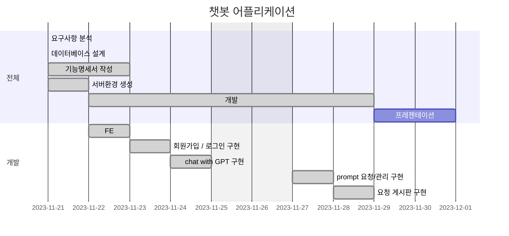
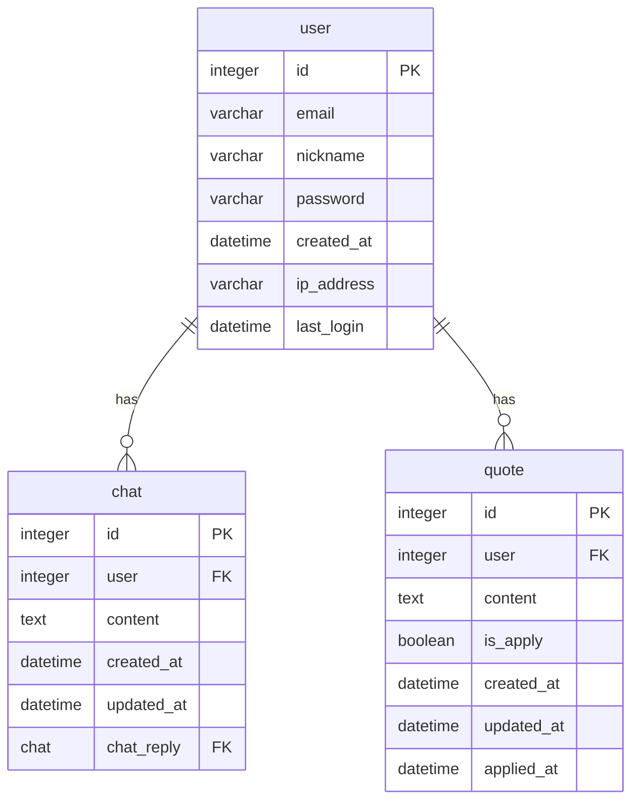

# ChatGPT를 이용한 챗봇 애플리케이션
드라마 스토브리그의 명대사를 찾아 봅시다. OpenAI ChatGPT API


## 목차
1. 요구사항
2. 프로젝트 구조
3. 데이터베이스 구조
4. 배포
5. 기능명세서
6. 화면설계
7. 관련 이슈
8. 회고

---

## 요구사항 명세
- 프로젝트 일정: **11월 21일(화) ~ 11월 30일(목)**
- DRF(Django Rest Framework)를 이용하여 서버를 구현합니다. 
- 로그인/회원가입을 구현합니다.
- ChatGPT로 요청을 보내주는 API를 Django내에 구현합니다.
    - (기존JS를 이용한방식) 프론트엔드에서 OpenAI API로 요청을 보냄
        - 프론트엔드 → OpenAI api 로 요청 → 응답값 프론트엔드에 반영
    - (변경해야 할 사항) 프론트엔드에서 Django서버를 통해 요청을 보내줍니다.
        - 프론트엔드 → Django서버 → Django서버에서 OpenAI api 로 요청 → Django서버에서 응답 받고 프론트엔드로 전달 → 응답값 프론트엔드에 반영
- 챗봇 API는 로그인을 한 유저만 사용가능합니다.
- 채팅을 데이터베이스에 저장합니다.
- 저장된 채팅 내역을 조회 할 수 있도록 구현합니다.
- 저장된 채팅 내역은 로그인한 본인만 볼 수 있습니다.
- 백엔드 배포, front 따로 배포
    


---

### 개발환경 및 기술

<div style="display:inline-block;">
    
    
    
</div>

---

### 프로젝트 구조
- BE
```sh
chatAPI
 ┣ .config
 ┃ ┗ uwsgi
 ┃ ┃ ┗ chatAPI.ini
 ┣ chat
 ┃ ┣ migrations
 ┃ ┃ ┣ 0001_initial.py
 ┃ ┃ ┣ 0002_alter_chat_chat_reply.py
 ┃ ┃ ┣ 0003_chat_description_chat_quote.py
 ┃ ┃ ┣ 0004_remove_chat_chat_reply_remove_chat_description_and_more.py
 ┃ ┃ ┣ 0005_rename_parent_chatreply_chat_and_more.py
 ┃ ┃ ┣ 0006_remove_chatreply_chat_chat_chat_reply.py
 ┃ ┃ ┣ 0007_remove_chat_chat_reply.py
 ┃ ┃ ┣ 0008_chat_chat_reply.py
 ┃ ┃ ┗ __init__.py
 ┃ ┣ __init__.py
 ┃ ┣ admin.py
 ┃ ┣ apps.py
 ┃ ┣ models.py
 ┃ ┣ paginator.py
 ┃ ┣ permissions.py
 ┃ ┣ serializers.py
 ┃ ┣ tests.py
 ┃ ┣ urls.py
 ┃ ┗ views.py
 ┣ chatAPI
 ┃ ┣ __init__.py
 ┃ ┣ asgi.py
 ┃ ┣ settings.py
 ┃ ┣ urls.py
 ┃ ┗ wsgi.py
 ┣ quote
 ┃ ┣ migrations
 ┃ ┃ ┣ 0001_initial.py
 ┃ ┃ ┗ __init__.py
 ┃ ┣ __init__.py
 ┃ ┣ admin.py
 ┃ ┣ apps.py
 ┃ ┣ models.py
 ┃ ┣ paginator.py
 ┃ ┣ permissions.py
 ┃ ┣ serializers.py
 ┃ ┣ tests.py
 ┃ ┣ urls.py
 ┃ ┗ views.py
 ┣ .env
 ┣ db.sqlite3
 ┣ manage.py
 ┣ quote.txt
 ┗ requirements.txt
```

- FE
```sh
js
 ┣ app.js
 ┣ board.js
 ┗ controller.js
css
 ┣ chat.css
 ┣ common.css
 ┣ layout.css
 ┣ list.css
 ┣ login-join.css
 ┣ table.css
 ┣ view.css
 ┗ write.css
img
 ┣ first.png
 ┣ icon-search.png
 ┣ icon-x.png
 ┣ last.png
 ┣ next.png
 ┗ prev.png
chat.html
index.html
join.html
login.html
quote.html
view.html
write.html
```
---

### 데이터베이스 구조

---
### 배포

AWS Lightsail 에서 배포하였습니다.

- BE
    - [52.78.247.51](http://52.78.247.51)


- FE
    - [3.39.238.230](http://3.39.238.230)
---

### 기능명세서
- **기본url** : 52.78.247.51
- **Content-Type** : application/json
- 인증이 필요한 공통 **Header**  
```
{
  Authorization : bearer TOKEN
}
```
|URL|GET|POST|PUT|DELETE|Description|
|---|---|---|---|---|---|
|/rest-auth/login|O|O|---|---|로그인|
|/rest-auth/logout|O|---|---|---|로그인|
|/rest-auth/join|O|O|---|---|회원 가입|
|/rest-auth/profile|O|---|O|O|회원 정보 수정 / 탈퇴|
|/chat/model|O|O|---|O|채팅|
|/quote|O|O|---|---|명대사 요청 게시판|
|/chat/api|---|O|---|---|챗봇 연동|
|/chat/delete|---|O|---|---|채팅 내역 삭제|

### /chat/api
- POST
  - Request
  ```
  {
    "input": "text"
  }
  ```
  - Resonse
  ```
  HTTP/1.1 200 OK
  {
      "scene" : 1,
      "quote" : "text",
      "description" : "text"
  }
  ```

### /chat/delete
- POST
    - Response
      ```
      HTTP/1.1 204 NO_CONTENT
      {
          
      }
      ```
      

### /chat/model
- GET
  - queryString

  |Key|Value|Default|Description|
  |---|---|---|---|
  |page|1|1|paging offset ( > 0)|
  |per-page|10|5|paging limit ( >= 5)|

  - Response
  ```
  HTTP/1.1 200 OK
  [
      "count": 11,
      "next": http://52.78.247.51/chat/model?page=2&per-page=5,
      "previous": null,
      "results": [
          {
            "id": 1,
            "user": "useremail",
            "content":"text",
            "created_at":"datetime",
            "chat_reply": {
              "id": 2,
              "user": "useremail",
              "quote":"text",
              "description":"text",
              "scene":"text",
              "created_at":"datetime",
            }
          },
          {2, ...},
          ...
          {5,...},
      ]
      "_links": [
        {
            "desc": "Self",
            "href": "http://52.78.247.51/chat/model/",
            "method": "GET"
        },
        {
            "desc": "New Chat",
            "href": "http://52.78.247.51/chat/model/",
            "method": "POST"
        }
    ]
  ]
  ```

  - POST
    - Request
    ```
    {
      "content": "흐리멍텅",
      "user": 1,
      "chat_reply": {
        "scene": 3,
        "quote": "윤성복: 임동규도 그렇고, 단장님은 가장 단단히 박힌 돌만 건드리네요. 저같은 사람 자르는 게 쉬웠을 텐데요.\n백승수: 박힌 돌에 이끼가 더 많을 겁니다.",
        "description": "3회에서 윤성복과 백승수 사이의 대화 중 윤성복이 백승수를 향해 한 말",
        "user": 1
      }
    }
    ```     
    - Response 
    ```
    HTTP/1.1 201 Created
    {
      "id": 1,
      "content": "흐리멍텅",
      "user": 1,
      "created_at": "2018-07-04 14:00:00",
      "chat_reply": {
            "id": 15,
            "quote": "윤성복: 임동규도 그렇고, 단장님은 가장 단단히 박힌 돌만 건드리네요. 저같은 사람 자르는 게 쉬웠을 텐데요.\n백승수: 박힌 돌에 이끼가 더 많을 겁니다.",
            "description": "3회에서 윤성복과 백승수 사이의 대화 중 윤성복이 백승수를 향해 한 말",
            "scene": "3",
            "created_at": "2023-11-30T15:24:13.833422+09:00",
            "user": 1
        },
      "_links": [
          {
            "desc": "Detail of chat",
            "href": "http://52.78.247.51/chat/model/1/",
            "method": "GET"
          }
      ]
    }

    ```

### /quote
- GET
  - queryString

  |Key|Value|Default|Description|
  |---|---|---|---|
  |page|1|1|paging offset ( > 0)|
  |per_page|10|5|paging limit ( >= 5)|

  - Response
  ```
  HTTP/1.1 200 OK
  [
      {
        "count": 1,
        "next": http://52.78.247.51/quote?page=2&per-page=5,
        "previous": null,
        "id": 1,
        "user": "useremail",
        "title":"text",
        "content":"text",
        "description":"text",
        "is_apply":True,
        "created_at":"datetime",
        "updated_at":"datetime",
        "applied_at":"datetime",
      },
      {2, ...},
      ...
      {5,...},
      "_links": [
        {
            "desc": "Self",
            "href": "http://52.78.247.51/quote/",
            "method": "GET"
        },
        {
            "desc": "New Quote",
            "href": "http://52.78.247.51/quote/",
            "method": "POST"
        }
    ]
  ]
  ```

- POST
  - Response 
  ```
  HTTP/1.1 201 Created
  {
    "id": 1,
    "content": "text",
    "user": 1,
    "title": "text",
    "description": "text",
    "created_at": "2018-07-04 14:00:00",
    "applied_at": "2018-07-04 14:00:00",
    "updated_at": "2018-07-04 14:00:00"
    "_links": [
        {
            "desc": "Self",
            "href": "http://52.78.247.51/quote/1",
            "method": "GET"
        },
        {
            "desc": "Update self",
            "href": "http://52.78.247.51/quote/1",
            "method": "PUT"
        },
        {
            "desc": "Delete self",
            "href": "http://52.78.247.51/quote/1",
            "method": "DELETE"
        }
    ]
  }
  ```


---

### 화면설계

|로그인|챗봇|
|---|---|
|||
|채팅 내역 삭제|게시판|
|||


---

### 관련 이슈


---

### 회고

---
