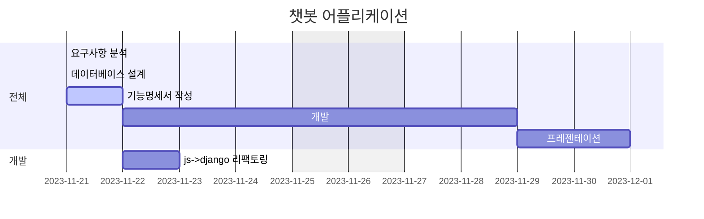

# ChatGPT를 이용한 챗봇 애플리케이션
드라마 스토브리그의 명대사를 찾아 봅시다. OpenAI ChatGPT API

## 목차
1. 요구사항
2. 프로젝트 구조
3. 데이터베이스 구조
4. 기능명세서
5. 화면설계
6. 관련 이슈
7. 회고

---

## 요구사항 명세
- 프로젝트 일정: **11월 21일(화) ~ 11월 30일(목)**
- DRF(Django Rest Framework)를 이용하여 서버를 구현합니다. 
- 로그인/회원가입을 구현합니다.
- ChatGPT로 요청을 보내주는 API를 Django내에 구현합니다.
    - (기존JS를 이용한방식) 프론트엔드에서 OpenAI API로 요청을 보냄
        - 프론트엔드 → OpenAI api 로 요청 → 응답값 프론트엔드에 반영
    - (변경해야 할 사항) 프론트엔드에서 Django서버를 통해 요청을 보내줍니다.
        - 프론트엔드 → Django서버 → Django서버에서 OpenAI api 로 요청 → Django서버에서 응답 받고 프론트엔드로 전달 → 응답값 프론트엔드에 반영
- 챗봇 API는 로그인을 한 유저만 사용가능합니다.
- 각 user 당 하루 5번만 요청할 수 있도록 구현합니다.
- 채팅을 데이터베이스에 저장합니다.
- 저장된 채팅 내역을 조회 할 수 있도록 구현합니다.
- 저장된 채팅 내역은 로그인한 본인만 볼 수 있습니다.
- (권장) 개인 도메인 등록, 프론트엔드, 백엔드 배포: https 추가하기 + front 따로 배포
    
    <aside>
    💡 https를 직접 진행하기 위해서는 도메인 구매가 필요합니다! 추가 점수는 아니니 상황에 맞게 선택해주세요.
    
    </aside>
    
    1. 내 서버에 https 적용하기
        
        keyword - domain 등록, https, nameserver, dns, let’s-encripts
        
        - 서버에 https를 적용하는 방법은 아래 페이지에서 배포하기(lightsail) 챕터를 참고해보세요 :)
            - [나의 MBIT(My Best IT personalities) Page 만들기!](https://www.notion.so/da22ebf1642c400cbb9cd4020649a1a7?pvs=21)
    2. 내 github-page를 http로 배포하기
        - github-page에서 커스텀 도메인을 등록한 후 github-page의 EnforceHTTPS 설정을 해제하고 http로 접속해보세요
- kakao, github 등 OAuth2 연결해보기

---

### 개발환경 및 기술

    
    
    

---

### 프로젝트 구조

---

### 데이터베이스 구조

---

### 화면설계

---

### 관련 이슈

---

### 회고

---
